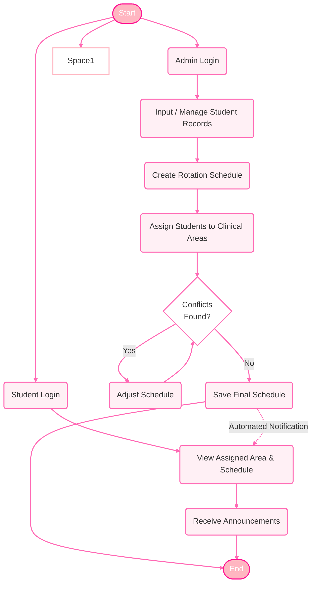
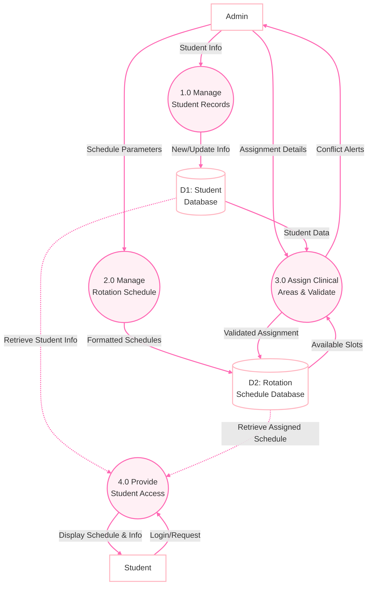
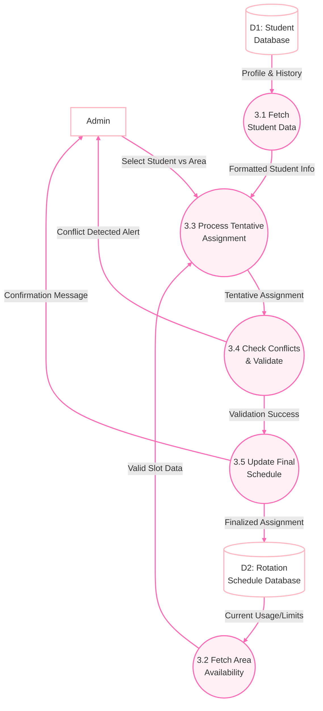

# Clinical Rotation Assignment System Diagrams

## 1. System Flowchart (Overall Flow)

**Description:**
This flowchart illustrates the end-to-end journey within the system, split between the **Admin** and **Student** flows. 
- **The Admin Flow** handles data ingestion (creating student records and base schedules) followed by the critical assignment process. A decision node (`Conflicts Found?`) enforces system validation: if a schedule overlaps or violates capacity, the admin is forced to adapt the schedule (`Adjust Schedule`) until the system clears it (`No Conflicts`).
- **The Student Flow** runs parallel, where students log in to view their approved areas and schedules. A connection is mapped showing that once the admin saves the final schedule, the student interface is updated.

---

## 2. DFD Level 0 (Context & Main Processes)

**Description:**
The DFD Level 0 maps out the core high-level modules of the system and how data moves between external entities (Admin and Student), processes, and data stores (Databases).
- **Process 1.0 & 2.0** represent fundamental CRUD (Create, Read, Update, Delete) operations feeding `D1` and `D2`.
- **Process 3.0** is the brain of the system, consuming data from both databases to map students to clinical rotation areas while providing feedback loops regarding conflicts straight to the Admin.
- **Process 4.0** acts as the delivery mechanism, pulling validated data from the databases and rendering it nicely to the Student entity interface.

---

## 3. DFD Level 1 (Decomposition of Process 3 - Assignment)

**Description:**
This internal diagram breaks down exactly how Process 3.0 assigns students and checks for conflicts.
- **Sub-processes 3.1 & 3.2** handle data retrieval, guaranteeing we are evaluating the assignment with up-to-date data.
- **Sub-process 3.3** bridges the Admin's command with the system data to create a *Tentative Assignment*.
- **Sub-process 3.4** is the validation gateway. It strictly denies overlapping schedules and alerts the Admin to make changes. Only if the validation logic is successful, does it hand the record forward.
- **Sub-process 3.5** locks it in, pushing the result to the main `Rotation Schedule Database` securely.
